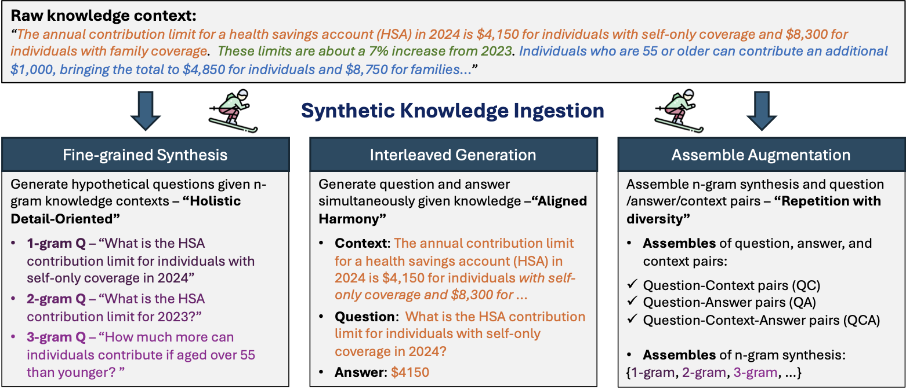
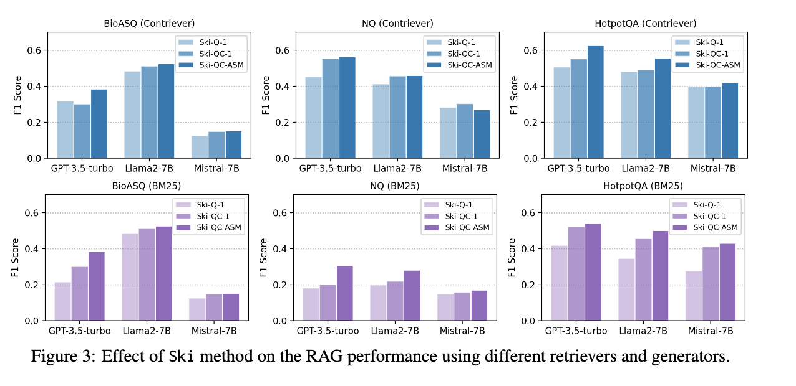

# Synthetic Knowledge Ingestion: Towards Knowledge Refinement and Injection for Enhancing Large Language Models

## Introduction
Large Language Models (LLMs) have shown strong capabilities in capturing factual knowledge across various domains. However, refining their knowledge on existing data or integrating new information from external sources remains a challenge. This paper introduces **Synthetic Knowledge Ingestion (Ski)**, a novel framework for creating high-quality data representations from unstructured knowledge sources to enhance LLMs’ factual accuracy and knowledge injection capabilities. For the full content of our paper, please see [here](https://arxiv.org/pdf/2410.09629)

## Methods


### Fine-grained Synthesis
Fine-grained synthesis generates hypothetical questions based on n-gram contexts within the data, capturing both specific and broad knowledge points. This synthesis method improves the alignment of questions and answers with the original content, increasing the diversity and quality of representations.

### Interleaved Generation
This strategy simultaneously generates questions and answers from specified knowledge contexts. The question-answer (QA) pairs created align directly with the knowledge base, simulating the process of information retrieval to ensure relevance and consistency in responses.

### Assemble Augmentation
Assemble augmentation compiles question-context and question-answer pairs across n-gram spans, balancing repetition with diversity. This component enhances the retrieval quality by consolidating and diversifying the knowledge representation for downstream tasks.

## Knowledge Injection
We integrate the Ski framework with three popular knowledge injection techniques to enhance LLMs:
1. **Retrieval Augmented Generation (RAG)** - Matches query embeddings to knowledge embeddings for effective retrieval and response.
2. **Supervised Fine-tuning (SFT)** - Uses Ski-generated question-answer pairs for fine-tuning, boosting LLM performance.
3. **Continual Pre-training (CPT)** - Employs Ski-augmented datasets in a continual training process, adapting models to specific domains or tasks.

## SKI Formats and Applications

1. **Q (Question / iHyDE)**
   - **Label**: `Q = "q"`
   - **Description**: Represents questions generated based on the knowledge base.
   - **Use**: Primarily for **RAG** (Retrieval Augmented Generation), where questions aid in retrieving relevant information from the knowledge base.

2. **QC (Question + Context)**
   - **Label**: `QC = "qc"`
   - **Description**: Combines questions with contextual knowledge pairs, where context provides background or supporting information.
   - **Use**: Useful for both **RAG** and **SFT**, as context helps improve retrieval and supports supervised fine-tuning by grounding answers in additional information.

3. **QCASM (Question + Context, Assembled)**
   - **Label**: `QCASM = "qc-asm"`
   - **Description**: An assembled format that aggregates multiple question-context pairs into one dataset for broader retrieval and augmentation.
   - **Use**: Primarily for **RAG** and **SFT** as an enhanced retrieval dataset, providing diverse question-context combinations.

4. **QA (Question + Answer)**
   - **Label**: `QA = "qa"`
   - **Description**: Focuses on pairs of questions and direct answers without additional context.
   - **Use**: Beneficial for **SFT** and **CPT**, where the focus is on refining the model’s understanding of question-answer relationships.

5. **QAASM (Question + Answer, Assembled)**
   - **Label**: `QAASM = "qa-asm"`
   - **Description**: An assembled dataset format that combines multiple QA pairs for consistent question-answer learning.
   - **Use**: Applied in **CPT** to continually pre-train models on aggregated QA knowledge, helping models learn answer patterns.

6. **QCA (Question + Context + Answer)**
   - **Label**: `QCA = "qca"`
   - **Description**: This format includes questions, context, and answers, providing comprehensive datasets for nuanced learning.
   - **Use**: Essential for both **SFT** and **CPT**, supporting supervised training by aligning questions, contexts, and answers, which enriches the model's response generation.

7. **QCAASM (Question + Context + Answer, Assembled)**
   - **Label**: `QCAASM = "qca-asm"`
   - **Description**: An aggregated format of QCA triplets to maximize training diversity by mixing multiple question-context-answer examples.
   - **Use**: Suited for **CPT**, where extended contexts with answers reinforce the model’s retention and comprehension.

### Summary Table

| Format    | Label    | Elements                    | Injection Strategy               |
|-----------|----------|-----------------------------|----------------------------------|
| **Q**     | `q`      | Question                    | RAG                              |
| **QC**    | `qc`     | Question + Context          | RAG, SFT                         |
| **QCASM** | `qc-asm` | Question + Context (ASM)    | RAG, SFT                         |
| **QA**    | `qa`     | Question + Answer           | SFT, CPT                         |
| **QAASM** | `qa-asm` | Question + Answer (ASM)     | CPT                              |
| **QCA**   | `qca`    | Question + Context + Answer | SFT, CPT                         |
| **QCAASM**| `qca-asm`| Question + Context + Answer, Assembled (ASM)  | CPT                              |


## Experiments
We conduct extensive evaluations on various question-answering tasks in finance, biomedicine, open-generation, and multi-hop reasoning domains using open-source models Llama2-7B and Mistral-7B. Our method shows substantial improvements over baseline approaches in retrieval, fine-tuning, and continual pre-training tasks. The experimental results demonstrate that synthetic knowledge ingestion significantly refines LLMs’ factual accuracy and knowledge retention across diverse question-answering datasets.


#### End-to-end RAG Results(f1 score) with Two Retrievers

| Model Method            | BioASQ | NQ    | HotpotQA |
|-------------------------|--------|-------|----------|
| **Contriever + GPT-3.5** |        |       |          |
| Raw Article             | 0.361  | 0.504 | 0.585    |
| Ski-Q-1 (iHyDE)         | 0.317  | 0.452 | 0.507    |
| Ski-QC-1                | 0.300  | 0.553 | 0.553    |
| **Ski-QC-ASM**          | **0.385**  | **0.563** | **0.627**    |
| **BM25 + GPT-3.5**      |        |       |          |
| Raw Article             | 0.227  | 0.258 | 0.443    |
| Ski-Q-1 (iHyDE)         | 0.162  | 0.181 | 0.274    |
| Ski-QC-1                | 0.186  | 0.201 | 0.377    |
| **Ski-QC-ASM**          | **0.243**  | **0.306** | **0.478**    |


#### SFT Performance(f1 score) on Two Pre-trained Models

| Model Method            | BioASQ | NQ    | HotpotQA |
|-------------------------|--------|-------|----------|
| **Mistral-7B**          |        |       |          |
| Base Model              | 0.125  | 0.098 | 0.113    |
| Vanilla QA              | 0.131  | 0.084 | 0.155    |
| Ski-QA-1                | **0.162**  | **0.159** | **0.171**    |
| Ski-QC-1                | 0.138  | 0.113 | 0.155    |
| Ski-QCA-1               | 0.160  | 0.157 | 0.163    |
| **Llama2-7B**           |        |       |          |
| Base Model              | 0.123  | 0.082 | 0.136    |
| Vanilla QA              | 0.235  | 0.150 | 0.203    |
| Ski-QA-1                | 0.357  | **0.218** | **0.266**    |
| **Ski-QC-1**            | **0.436**  | 0.217 | 0.258   |
| Ski-QCA-1               | 0.271  | 0.201 | 0.252    |

#### CPT Performance(f1 score) on Llama2-7B

| Method                  | BioASQ | NQ    | HotpotQA |
|-------------------------|--------|-------|----------|
| Base Model              | 0.123  | 0.082 | 0.136    |
| Raw Article (only context) | 0.219  | 0.166 | 0.242    |
| Ski-C-1 (1-gram context) | 0.208  | 0.178 | 0.204    |
| **Ski-C-ASM (1-3-gram context)** | 0.241  | 0.163 | **0.253**   |
| **Ski-QA-1**            | 0.269  | 0.184 | 0.205    |
| Ski-QA-ASM              | 0.228  | 0.194 | 0.218    |
| **Ski-QC-1**            | 0.294  | 0.178 | 0.226    |
| **Ski-QC-ASM**          | **0.335**  | 0.182 | 0.215    |
| Ski-QCA-1               | 0.211  | 0.188 | 0.218    |
| Ski-QCA-ASM             | 0.220  | **0.197** | 0.191    |

## Run the code

### Data Generation
To generate data, make the configuration in `data_generation/data_generator.py` and then run `python data_generation/data_generator.py`.

If the task data is not already downloaded, it will download the data using [Beir](https://github.com/beir-cellar/beir/tree/main). So if a task is not downloadble like bioasq, you would need to manullay configure it.

All modes in `ski_mode.py` are supported. When generating for training purpose, set `for_training=True` and ensure your dataset has training split available.

### Knowledge Ingestion

#### RAG
For Retreival, four tasks are ran: `bioasq`, `hotpotqa`, `fiqa` and `nq`. For Rag, three tasks are run: `bioasq`, `hotpotqa` and `nq`.

To get the retreival data for bioasq, follow instructions [here](https://github.com/beir-cellar/beir/tree/main/examples/dataset#2-bioasq).

Available modes for retreival are: `SKIMode.Q`, `SKIMode.QC`, `SKIMode.QCASM`.

To run experiments, first configure in `rag/rag.py` and then run `python rag/rag.py`.

#### SFT/CPT

We used SFT(Supervised fine-tuning) and CPT(Continuous pre-training) for knowledge injection. We created a pipeline based on [LLaMA-Factory](https://github.com/hiyouga/LLaMA-Factory), a comprehensive framework that integrates advanced efficient training techniques on various LLMs. This pipeline allows us to first run the training script, and then merge the model weights and get evaluation metrics on test data.

To run the scripts, please refer to detailed instructions [here](https://github.intuit.com/AIResearch/Knowledge-injection/blob/master/finetuning/README.md).

## Citation
If you use this code, please cite the following paper:
```
@inproceedings{zhang2024ski,
      title={Synthetic Knowledge Ingestion: Towards Knowledge Refinement and Injection for Enhancing Large Language Models},
      author={Jiaxin Zhang, Wendi Cui, Yiran Huang, Kamalika Das, Sricharan Kumar},
      booktitle={EMNLP 2024},
      year={2024},
      primaryClass={cs.CL}
}
```
